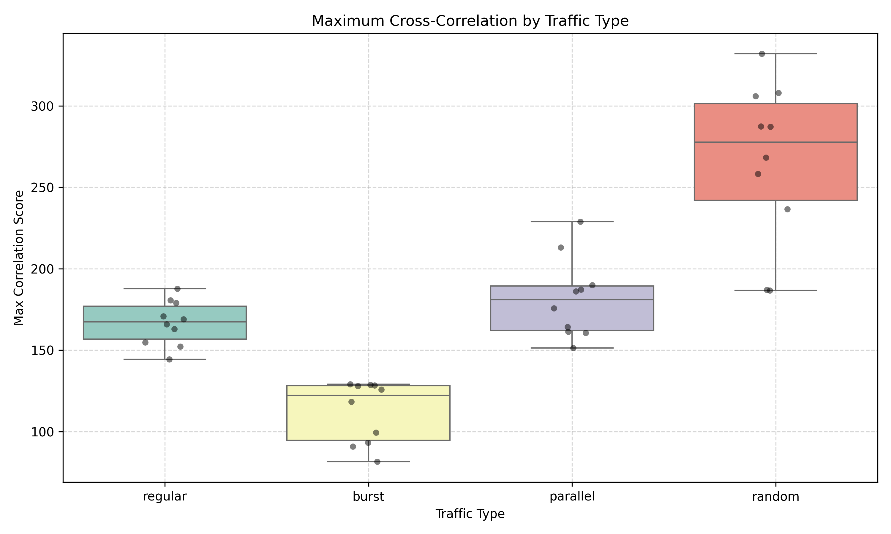

# Timing Correlation Analysis

This document summarizes the results of timing-based correlation analysis across different Tor traffic behaviors.

## Method Summary
- Captured traffic in a local Tor network for 4 traffic types: regular, burst, parallel, random
- Extracted timestamps from `.pcap` files using `tshark`
- Binned timestamps into 100ms windows and normalized
- Computed maximum cross-correlation scores between client and server captures

### Assumption: Known Client–Server Pairs
In this study, each .pcap file is recorded from a controlled setup with synchronized Tor client and server sessions. For every clientX.pcap, we know the corresponding serverX.pcap.

This assumption allows us to directly compute cross-correlations between matching pairs, which helps validate the effectiveness of the timing correlation metric under ideal conditions.

 Note: In real-world scenarios, such exact pairing is not available to attackers. A practical correlation attack would need to identify the most likely server for each observed client based on correlation scores across all possible combinations.

#### Future work could explore this more realistic threat model by:
- Removing known pairings,
- Performing full NxN correlation analysis (all clients vs. all servers),
- Using ranking-based success metrics (e.g., Top-1 or Top-k match accuracy).

## Results
### Cross-Correlation Scores by Traffic Type

#### Interpretation
- **Random traffic** shows the highest variance and maximum scores — making it potentially more exposed.
- **Burst traffic** consistently has the lowest correlation, suggesting it may help defend against linkability.
- **Parallel traffic** shows moderate vulnerability, possibly due to overlapping flows.
- **Regular traffic** has stable but moderately high correlation scores.

## Conclusion
The experiment confirms that:
- Timing-based correlation is effective under many traffic conditions.
- Traffic shaping (e.g., bursts or delays) can significantly reduce vulnerability.
- Randomness alone does not guarantee safety and can sometimes produce correlatable patterns.

